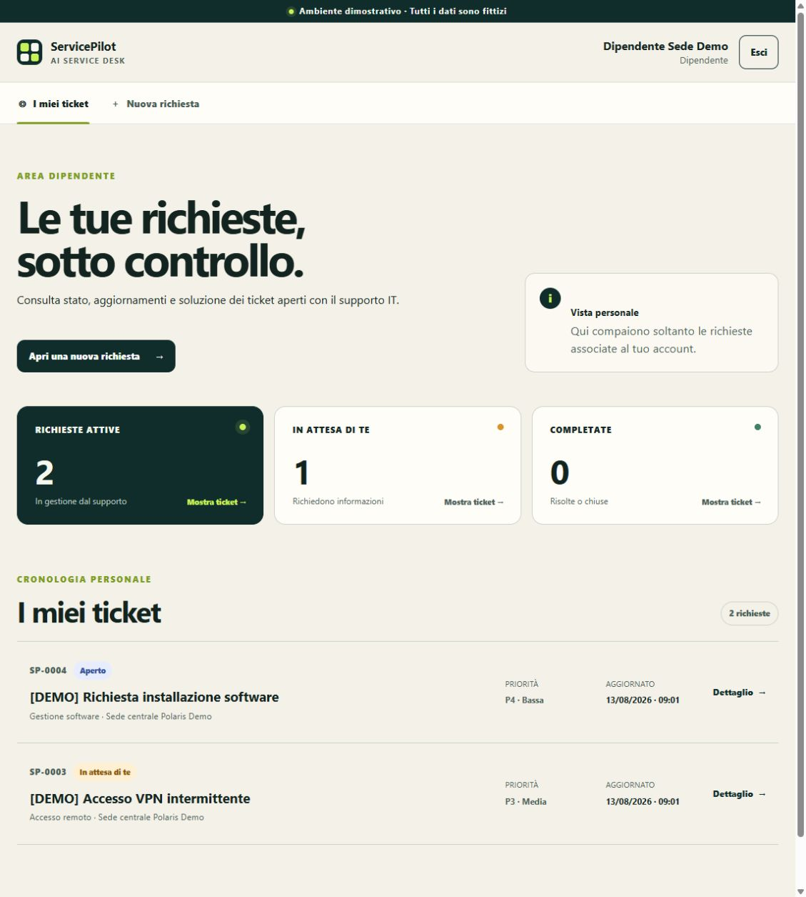
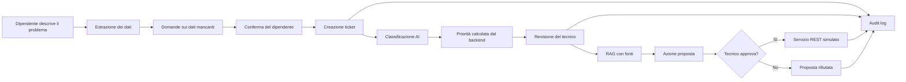
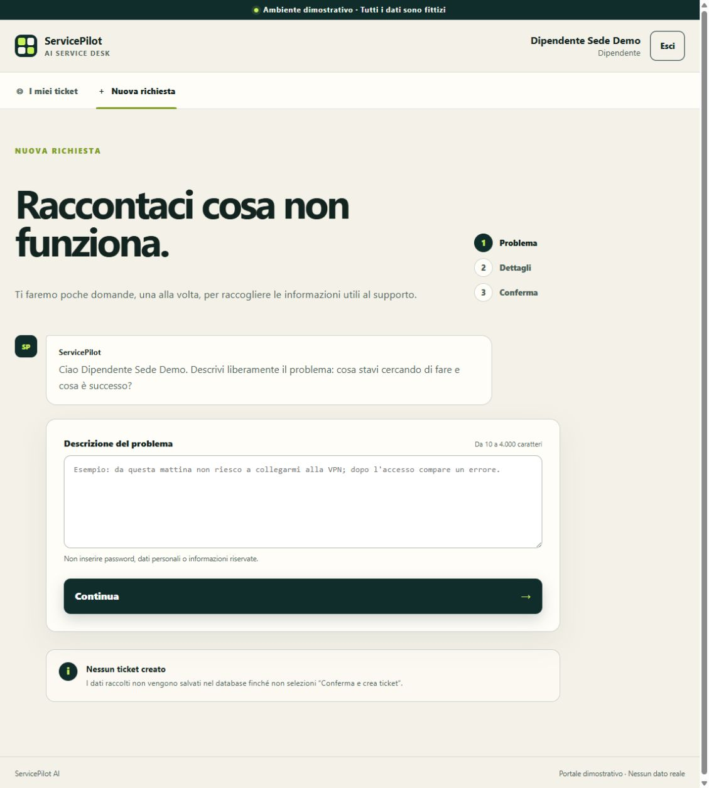
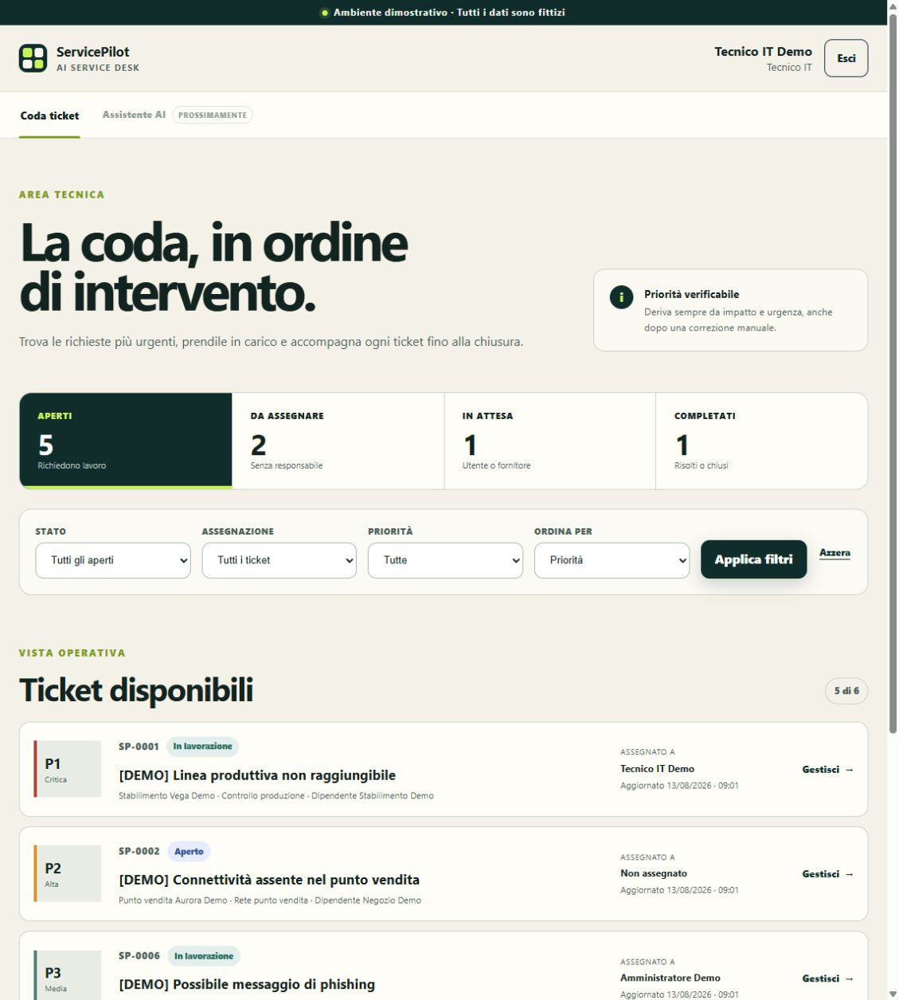
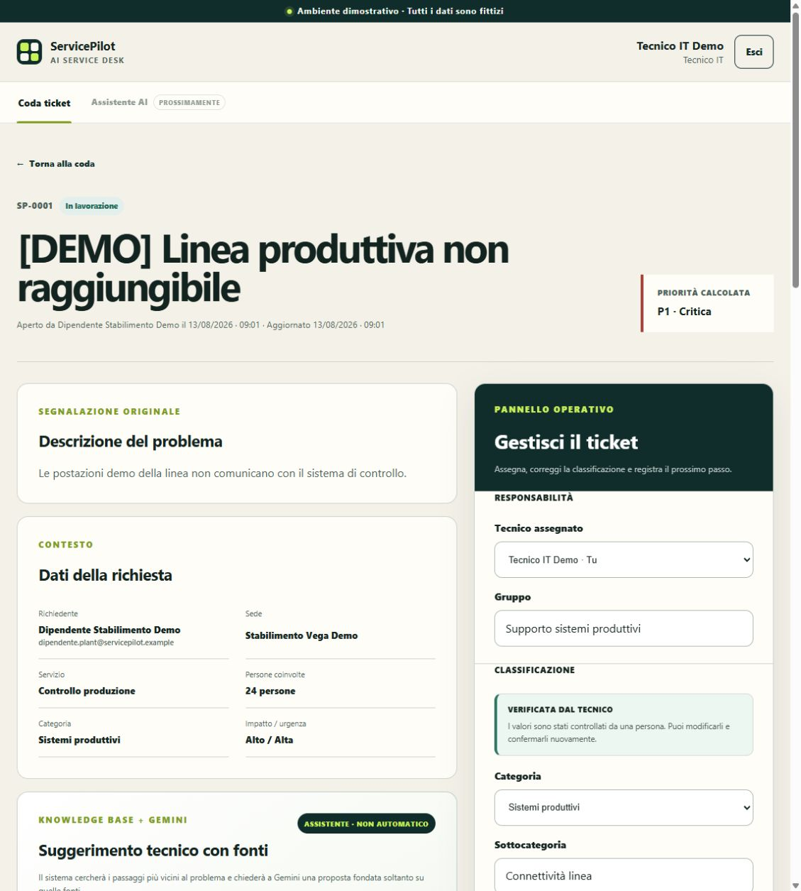
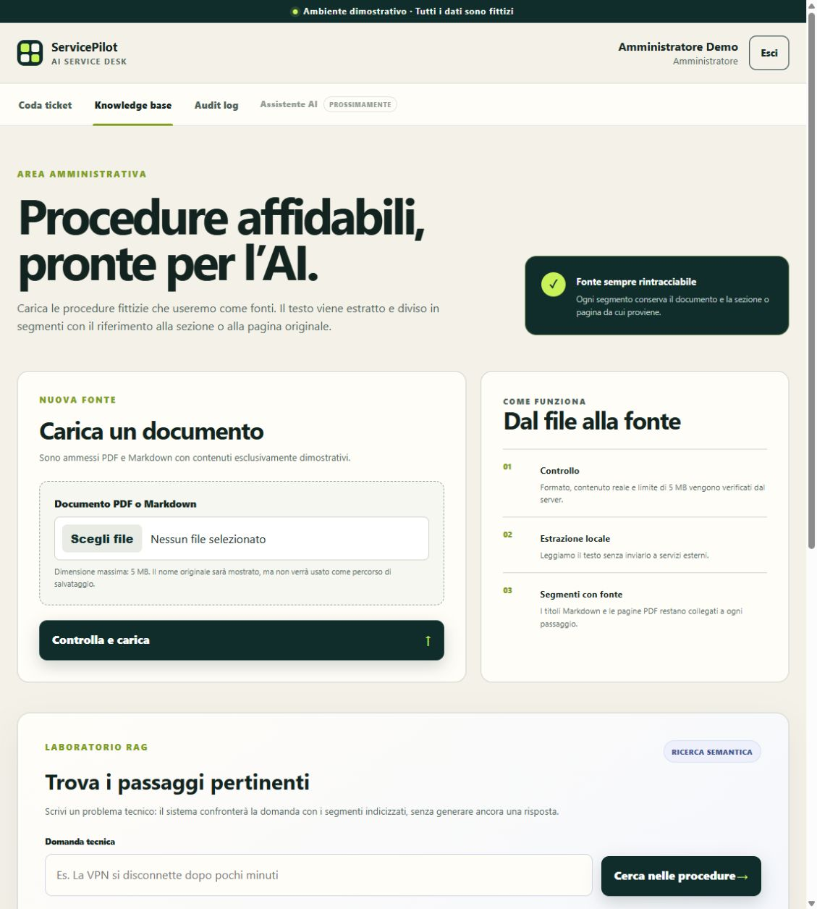
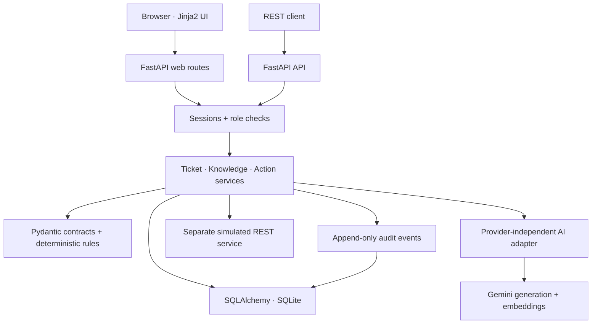

# ServicePilot AI

> AI-assisted IT service desk with deterministic rules, grounded knowledge and human approval.
> Portale IT assistito dall'AI, con regole deterministiche, fonti verificabili e approvazione umana.

[](https://github.com/Ciss02/ServicePilot/actions/workflows/quality.yml)
[](https://github.com/Ciss02/ServicePilot/releases/tag/v0.1.0)
[](https://www.python.org/)
[](https://fastapi.tiangolo.com/)
[](LICENSE)

[Italiano](#italiano) · [English](#english) · [Demo online](https://servicepilot-ai-demo-ciss02.onrender.com) · [Release v0.1.0](https://github.com/Ciss02/ServicePilot/releases/tag/v0.1.0) · [Documentazione](docs/README.md) · [Architettura](docs/ARCHITECTURE.md)



## Italiano

### Il progetto in breve

ServicePilot AI è un MVP da portfolio che digitalizza il ciclo completo di una richiesta
di assistenza IT in un'azienda fittizia con più sedi. Un dipendente descrive liberamente
il problema; l'app raccoglie i dati mancanti, richiede una conferma esplicita e crea il
ticket. L'AI aiuta a classificare la richiesta e a trovare procedure pertinenti, ma le
decisioni operative restano sotto il controllo di regole verificabili e persone reali.

Il progetto dimostra insieme sviluppo web, API REST, persistenza, autenticazione per
ruolo, integrazione Gemini, RAG con citazioni, tool calling simulato, audit e deploy.
Tutti gli utenti, i ticket, le sedi e i documenti sono sintetici.

### Demo pubblica

La demo è disponibile su
**[servicepilot-ai-demo-ciss02.onrender.com](https://servicepilot-ai-demo-ciss02.onrender.com)**.

Il piano gratuito può sospendere il servizio quando non viene usato: il primo
caricamento può quindi richiedere fino a circa 50 secondi. Gli indirizzi degli account
dimostrativi sono visibili nella pagina di accesso; le password non sono conservate nel
repository e vengono condivise separatamente per le presentazioni del portfolio.

### Cosa può fare

| Ruolo | Funzioni principali |
| --- | --- |
| Dipendente | Apre un ticket con una conversazione guidata, conferma i dati e consulta soltanto le proprie richieste. |
| Tecnico IT | Filtra la coda, verifica la classificazione AI, corregge impatto e urgenza, consulta suggerimenti con fonti e approva o rifiuta azioni. |
| Amministratore | Gestisce gruppi di supporto, knowledge base e reset demo, consulta l'audit completo e usa tutti gli strumenti tecnici. |

Scelte centrali dell'MVP:

- **priorità deterministica:** Gemini propone impatto e urgenza, mentre il backend
  calcola P1-P4 con una matrice testata;
- **conferma prima della creazione:** il modello non può aprire autonomamente un ticket;
- **RAG con fonti:** un suggerimento tecnico è accettato soltanto se cita segmenti
  realmente recuperati da una procedura;
- **human in the loop:** assegnazione, comunicazione ed escalation partono soltanto
  dopo l'approvazione esplicita del tecnico;
- **audit atomico:** gli eventi vengono salvati insieme all'operazione che descrivono;
- **funzionamento degradato:** raccolta e classificazione manuali restano disponibili
  se Gemini è disattivato o non risponde.

### Flusso principale



La vista completa dei componenti e dei confini di sicurezza è in
[`docs/ARCHITECTURE.md`](docs/ARCHITECTURE.md).

### Schermate

<table>
  <tr>
    <td width="50%"><br><strong>Raccolta guidata</strong>: il ticket nasce soltanto dopo il riepilogo e la conferma.</td>
    <td width="50%"><br><strong>Coda tecnica</strong>: filtri, assegnazione e priorità verificabile.</td>
  </tr>
  <tr>
    <td width="50%"><br><strong>Dettaglio operativo</strong>: classificazione, RAG e controllo umano nello stesso flusso.</td>
    <td width="50%"><br><strong>Knowledge base</strong>: upload controllato, segmentazione, ricerca e ripristino demo.</td>
  </tr>
</table>

### Tecnologie

- Python 3.13, FastAPI e Pydantic;
- SQLAlchemy, Alembic e SQLite per l'MVP;
- Jinja2, HTML e CSS responsive;
- Gemini tramite adapter sostituibile;
- embedding Gemini e recupero semantico locale;
- PDF/Markdown con metadati di documento, sezione e pagina;
- pytest, Ruff e GitHub Actions;
- Render Blueprint per la demo pubblica.

### Avvio locale rapido

Prerequisiti: Git e Python 3.13.

```bash
git clone https://github.com/Ciss02/ServicePilot.git
cd ServicePilot
python -m venv .venv
```

Attivare l'ambiente e installare le dipendenze:

```powershell
# Windows PowerShell
.\.venv\Scripts\Activate.ps1
python -m pip install -r requirements-dev.txt
```

```bash
# macOS / Linux
source .venv/bin/activate
python -m pip install -r requirements-dev.txt
```

Configurare tre password locali, diverse e di almeno 12 caratteri. I valori seguenti
vengono richiesti senza essere scritti nel repository:

```powershell
$env:SERVICEPILOT_DEMO_EMPLOYEE_PASSWORD = Read-Host "Password dipendenti demo"
$env:SERVICEPILOT_DEMO_TECHNICIAN_PASSWORD = Read-Host "Password tecnico demo"
$env:SERVICEPILOT_DEMO_ADMIN_PASSWORD = Read-Host "Password amministratore demo"
```

```bash
read -s -p "Password dipendenti demo: " SERVICEPILOT_DEMO_EMPLOYEE_PASSWORD; export SERVICEPILOT_DEMO_EMPLOYEE_PASSWORD
read -s -p "Password tecnico demo: " SERVICEPILOT_DEMO_TECHNICIAN_PASSWORD; export SERVICEPILOT_DEMO_TECHNICIAN_PASSWORD
read -s -p "Password amministratore demo: " SERVICEPILOT_DEMO_ADMIN_PASSWORD; export SERVICEPILOT_DEMO_ADMIN_PASSWORD
```

Avviare portale, dataset sintetico e servizi REST simulati:

```bash
python -m app.deployment
```

L'avvio applica automaticamente le migrazioni database versionate prima di caricare i
dati demo; non sono richiesti comandi separati durante il deploy.

Aprire `http://127.0.0.1:8000/login`. Gli account principali sono:

- `dipendente.hq@servicepilot.example`;
- `tecnico@servicepilot.example`;
- `admin@servicepilot.example`.

L'AI e gli embedding sono disattivati per impostazione predefinita: l'intero flusso
manuale resta utilizzabile senza chiave e senza costi. Per una prova con Gemini,
configurare localmente `GEMINI_API_KEY`, `SERVICEPILOT_AI_PROVIDER=gemini` e
`SERVICEPILOT_EMBEDDING_PROVIDER=gemini`. La configurazione completa è descritta in
[`docs/AI_MODEL_ADAPTER.md`](docs/AI_MODEL_ADAPTER.md) e
[`docs/KNOWLEDGE_SEARCH.md`](docs/KNOWLEDGE_SEARCH.md).

### Verifica

```bash
python -m pip check
python -m ruff check .
python -m ruff format --check .
python -m pytest -W error
```

Gli stessi controlli vengono eseguiti da GitHub Actions su ogni pull request e su
`main`. La suite non usa chiamate AI reali.

### Struttura essenziale

```text
app/
├── actions/          # proposte, approvazione e chiamate ai servizi fittizi
├── ai/               # adapter Gemini, output strutturati, limiti ed embedding
├── api/              # API REST autenticate
├── audit/            # eventi append-only
├── db/               # modelli SQLAlchemy e dataset sintetico
├── domain/           # vocabolario, contratti e regole deterministiche
├── knowledge/        # upload, estrazione, segmentazione, ricerca e RAG
├── security/         # password, sessioni, ruoli e protezioni browser
├── templates/        # pagine Jinja2
└── web/              # rotte e presentazione web
tests/                # test per dominio, API, AI, sicurezza, RAG e interfaccia
docs/                 # specifica, decisioni e documentazione tecnica
render.yaml           # descrizione del deploy pubblico
```

### Sicurezza, privacy e limiti

La demo usa soltanto dati sintetici. Chiavi e password restano lato server e fuori da
Git; le password sono trasformate con Argon2 e nel database entra soltanto l'impronta
dei token di sessione. Upload e chiamate AI hanno limiti espliciti.

Limiti dichiarati dell'MVP:

- account condivisi, senza registrazione, MFA o recupero password;
- SQLite e file temporanei nel deploy gratuito: non sono adatti a dati persistenti;
- una sola istanza e contatori AI/login in memoria;
- nessun antivirus sugli upload, ammessi solo per l'admin e con documenti fittizi;
- servizi di assegnazione, comunicazione ed escalation completamente simulati;
- nessuna integrazione reale con Active Directory, Microsoft 365 o strumenti ITSM;
- nessun uso autorizzato con dati aziendali o personali reali.

La revisione completa è in
[`docs/SECURITY_AND_DEMO_LIMITS.md`](docs/SECURITY_AND_DEMO_LIMITS.md).

### Roadmap

- **v0.1.0 — MVP portfolio pubblicato:** [release GitHub](https://github.com/Ciss02/ServicePilot/releases/tag/v0.1.0),
  demo online, documentazione finale e schermate dei flussi principali;
- **dopo l'MVP:** PostgreSQL e archivio persistente, processi in background,
  osservabilità ed evaluation automatica delle risposte RAG;
- **per un prodotto reale:** identità aziendale, CSRF token dedicati, scansione malware,
  rate limit condivisi, gestione centralizzata dei segreti e integrazioni ITSM reali.

La tasklist verificabile è in [`docs/PROJECT_PLAN.md`](docs/PROJECT_PLAN.md); la roadmap
di apprendimento è in
[`docs/ServicePilot_4_Week_Learning_and_Build_Roadmap.md`](docs/ServicePilot_4_Week_Learning_and_Build_Roadmap.md).

### Documentazione principale

- [Indice completo della documentazione](docs/README.md)
- [Specifica dell'MVP](docs/ServicePilot_AI_MVP_Specification.md)
- [Architettura e flussi](docs/ARCHITECTURE.md)
- [Decisioni tecniche](docs/DECISIONS.md)
- [API dei ticket](docs/TICKET_API.md)
- [Autenticazione e autorizzazione](docs/AUTHENTICATION.md)
- [RAG e suggerimenti con fonti](docs/SOURCED_SOLUTIONS.md)
- [Azioni con approvazione umana](docs/ACTION_APPROVAL.md)
- [Audit log](docs/AUDIT_LOG.md)
- [Qualità e test](docs/QUALITY_CHECKS.md)
- [Deploy e ripristino](docs/DEPLOYMENT.md)

## English

### Overview

ServicePilot AI is a portfolio MVP covering the complete lifecycle of an IT support
request in a fictional multi-site company. An employee describes a problem in natural
language; the application collects missing details, requires explicit confirmation and
creates the ticket. AI assists classification and knowledge retrieval, while business
rules and people retain control over priority and operational actions.

The project demonstrates web development, REST APIs, persistence, role-based access,
Gemini integration, citation-backed RAG, simulated tool calling, auditability and public
deployment. Every user, location, ticket and document is synthetic.

### Live demo

Open **[servicepilot-ai-demo-ciss02.onrender.com](https://servicepilot-ai-demo-ciss02.onrender.com)**.
The free instance may sleep after inactivity, so its first response can take roughly
50 seconds. Demo emails are shown on the sign-in page. Passwords are deliberately kept
out of the repository and are shared separately for portfolio presentations.

### MVP capabilities

- guided and confirmed ticket creation for employees;
- AI-assisted extraction and classification with validated structured output;
- deterministic P1-P4 priority calculation in the backend;
- technician queue, assignment, correction and controlled state transitions;
- PDF/Markdown knowledge ingestion, embeddings and semantic retrieval;
- grounded technical suggestions with visible document and section citations;
- human approval before any simulated assignment, notification or escalation;
- append-only application audit trail;
- admin-only knowledge management and repeatable demo reset;
- local and GitHub quality checks without real AI calls.

### Architecture



See [`docs/ARCHITECTURE.md`](docs/ARCHITECTURE.md) for component responsibilities,
data flows, trust boundaries and deployment trade-offs.

### Quick start

Requirements: Git and Python 3.13.

```bash
git clone https://github.com/Ciss02/ServicePilot.git
cd ServicePilot
python -m venv .venv
source .venv/bin/activate       # macOS / Linux
# .\.venv\Scripts\Activate.ps1 # Windows PowerShell
python -m pip install -r requirements-dev.txt
```

Set `SERVICEPILOT_DEMO_EMPLOYEE_PASSWORD`,
`SERVICEPILOT_DEMO_TECHNICIAN_PASSWORD` and
`SERVICEPILOT_DEMO_ADMIN_PASSWORD` to three different values of at least 12 characters,
then run:

```bash
python -m app.deployment
```

Open `http://127.0.0.1:8000/login`. The default local configuration keeps AI and
embeddings disabled, so no API key or paid request is required. The Italian quick-start
section above includes ready-to-use PowerShell and shell commands.

### Quality checks

```bash
python -m pip check
python -m ruff check .
python -m ruff format --check .
python -m pytest -W error
```

GitHub Actions runs the same checks for pull requests and `main`.

### Security and known limitations

Secrets remain server-side, Argon2 protects demo passwords, only session-token hashes
are stored, browser requests receive security headers, and uploads and AI usage have
explicit limits. This remains a portfolio demo rather than a production service:

- shared accounts with no registration, MFA or password recovery;
- ephemeral SQLite and uploaded files on the free deployment;
- single-instance, in-memory login and AI counters;
- no malware scanner for admin uploads;
- fully simulated external actions;
- no real identity, Microsoft 365 or ITSM integration;
- synthetic data only.

Read [`docs/SECURITY_AND_DEMO_LIMITS.md`](docs/SECURITY_AND_DEMO_LIMITS.md) for the full
review.

The complete documentation map, including the distinction between current technical
guides and historical project records, is in [`docs/README.md`](docs/README.md).

### Roadmap

- **v0.1.0 — portfolio MVP released:** [GitHub release](https://github.com/Ciss02/ServicePilot/releases/tag/v0.1.0),
  live demo, final documentation and screenshots of the main flows;
- **post-MVP:** PostgreSQL and persistent object storage, background jobs,
  observability and automated RAG evaluations;
- **production path:** corporate identity, dedicated CSRF tokens, malware scanning,
  shared rate limits, managed secrets and real ITSM integrations.

## License and AI disclosure

Released under the [MIT License](LICENSE).

AI coding tools were used as development assistants. Requirements, scope, design
decisions, implementation steps and verification evidence are kept in the repository
and GitHub history so the result can be reviewed independently.
