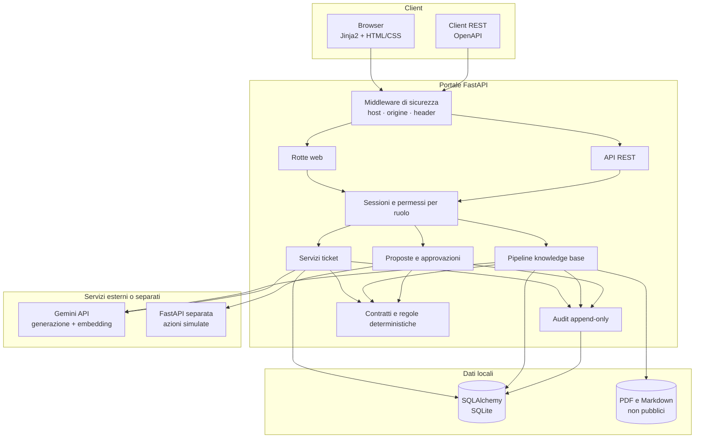
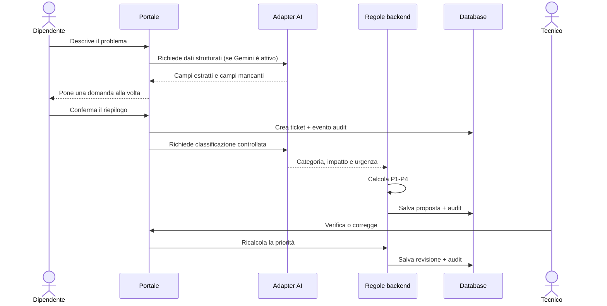
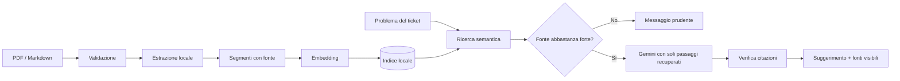
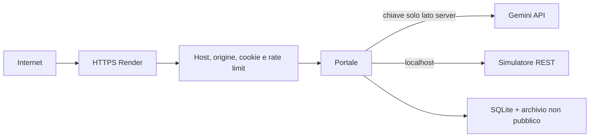

# Architettura di ServicePilot AI

> [English summary](#english-summary)

Questo documento descrive come i componenti dell'MVP collaborano e dove vengono
applicati i controlli. La scelta principale è separare ciò che l'AI può **proporre** da
ciò che il sistema o una persona possono **decidere ed eseguire**.

## Vista generale



## Responsabilità dei componenti

| Area | Responsabilità | Controllo importante |
| --- | --- | --- |
| `app/web` e `app/templates` | Pagine per dipendente, tecnico e amministratore | La pagina non sostituisce mai i controlli del backend. |
| `app/api` | Operazioni REST sui ticket e sull'autenticazione | La sessione e la visibilità vengono ricontrollate a ogni richiesta. |
| `app/security` | Password, sessioni, ruoli e protezioni browser | Nel database entra l'impronta del token, non il token stesso. |
| `app/domain` | Vocabolario, contratti Pydantic e priorità | La priorità è calcolata da una matrice, non dal modello AI. |
| `app/tickets` | Creazione, lettura e aggiornamento dei ticket | La creazione richiede conferma e le transizioni sono validate. |
| `app/ai` | Adapter Gemini, output strutturati, embedding e limiti | Le risposte esterne vengono validate prima dell'uso. |
| `app/knowledge` | Upload, estrazione, segmentazione, indice, ricerca e RAG | Un suggerimento può citare soltanto segmenti realmente recuperati. |
| `app/actions` | Proposta, decisione e chiamata dei servizi fittizi | Nessuna chiamata parte prima dell'approvazione del tecnico. |
| `app/audit` | Eventi umani, AI e automatici | L'evento viene salvato nella stessa transazione dell'operazione. |
| `app/simulated_services` | Assegnazione, comunicazione ed escalation dimostrative | Non modifica sistemi reali e produce errori ripetibili per i test. |

## Flusso 1: apertura e classificazione



Se Gemini è disattivato, non disponibile o restituisce dati non validi, il ticket non
viene perso: raccolta e classificazione continuano manualmente.

## Flusso 2: suggerimento con fonti

1. L'amministratore carica un PDF o Markdown sintetico.
2. Il backend controlla estensione, tipo reale, dimensione e limite del testo estratto.
3. Il testo viene suddiviso in segmenti che conservano documento, sezione o pagina.
4. Gli embedding vengono validati, normalizzati e salvati con il modello utilizzato.
5. La domanda del tecnico recupera i passaggi più simili.
6. Se nessun passaggio supera la soglia, il processo si ferma prima di Gemini.
7. Gemini riceve al massimo tre passaggi e restituisce testo e identificativi di fonte.
8. Il backend rifiuta citazioni che non appartengono ai passaggi forniti.
9. Suggerimento e fonti vengono salvati insieme, senza cambiare lo stato del ticket.



## Flusso 3: azione proposta e approvazione

Una proposta contiene tipo, motivazione, payload ed effetto previsto, ma non modifica il
ticket. Il tecnico può rifiutarla oppure approvarla. L'approvazione viene persistita
prima della chiamata REST; un aggiornamento condizionale impedisce al doppio invio di
eseguire due volte la stessa azione.

Il simulatore è un'applicazione FastAPI separata e supporta tre operazioni:

- assegnazione a un gruppo o tecnico fittizio;
- comunicazione dimostrativa al richiedente;
- escalation verso un fornitore fittizio.

Può restituire successi o errori `503` deterministici. Non invia messaggi, non contatta
fornitori e non modifica sistemi esterni.

## Dati e transazioni

SQLAlchemy gestisce utenti, sedi, ticket, sessioni, documenti, segmenti, embedding,
fonti dei suggerimenti, azioni ed eventi audit. SQLite è sufficiente per una demo a
istanza singola; l'indirizzo del database è configurabile tramite
`SERVICEPILOT_DATABASE_URL`.

Le operazioni che devono rimanere coerenti condividono una transazione. Per esempio:

- creazione del ticket ed evento di creazione;
- conferma della classificazione ed evento di revisione;
- salvataggio del suggerimento e delle fonti;
- decisione, avvio ed esito di un'azione;
- ripristino completo del dataset demo.

I documenti caricati restano in una cartella non pubblica e ignorata da Git. Il database
conserva un nome interno casuale e i metadati necessari a mostrare il nome originale.

## Confini di sicurezza



- le password vengono trasformate con Argon2;
- i token di sessione sono casuali e nel database entra soltanto la loro impronta;
- ruoli e proprietà del ticket sono controllati nel backend;
- gli invii browser controllano `Origin` o `Referer`;
- CSP, HSTS, anti-frame, `nosniff` e `no-store` proteggono la demo pubblica;
- chiave Gemini e password sono variabili d'ambiente, mai file versionati;
- login, AI, embedding, upload e testo estratto hanno limiti espliciti.

Rischi e limiti residui sono descritti senza eccezioni in
[`SECURITY_AND_DEMO_LIMITS.md`](SECURITY_AND_DEMO_LIMITS.md).

## Deploy

Il Blueprint [`render.yaml`](../render.yaml) crea una singola istanza web gratuita in
Frankfurt. `python -m app.deployment`:

1. prepara le cartelle temporanee;
2. crea o riallinea il dataset sintetico;
3. avvia il simulatore su `127.0.0.1:8011`;
4. avvia il portale sulla porta assegnata da Render.

Solo il portale è esposto a Internet. Il simulatore rimane raggiungibile esclusivamente
dalla stessa istanza. Il deploy automatico parte dopo il superamento dei controlli
GitHub. SQLite e file caricati sono intenzionalmente temporanei sul piano gratuito.

## Qualità e prove

La suite copre dominio, database, API, pagine, sicurezza, AI, RAG, azioni, audit e
deploy. Nei test gli adapter esterni sono sostituiti da risposte controllate, quindi la
CI non richiede segreti e non consuma chiamate Gemini.

Controlli condivisi tra computer locale e GitHub Actions:

```text
pip check
ruff check .
ruff format --check .
pytest -W error
```

Il collaudo pubblico aggiunge una prova end-to-end da sessione anonima: creazione,
revisione tecnica, azione simulata, audit e ripristino del dataset.

## Perché questa architettura

1. **Quale problema risolve?** Separa automazione utile, decisioni di business e
   responsabilità umana in un flusso IT tracciabile.
2. **Quali dati riceve?** Testo del problema, dati del ticket, documenti sintetici,
   decisioni tecniche e configurazione lato server.
3. **Dove vengono controllati?** Nei contratti Pydantic, nei servizi di dominio, nei
   controlli di ruolo e nei confini AI/RAG.
4. **Dove vengono salvati?** Nei modelli SQLAlchemy e nell'archivio documentale privato;
   i segreti non vengono salvati dall'app.
5. **Cosa può andare storto?** Provider non disponibile, fonte debole, doppio invio,
   simulatore in errore, upload non valido o configurazione pubblica insicura.
6. **Chi può usare cosa?** Dipendenti sui propri ticket, tecnici sulla coda e sulle
   decisioni operative, amministratori sugli strumenti globali.
7. **Quale test dimostra che funziona?** Test unitari e d'integrazione per ogni confine,
   CI senza segreti e collaudo pubblico con reset finale.

## English summary

ServicePilot uses a layered FastAPI application so AI suggestions, deterministic
business rules and human decisions remain separate and testable. Browser pages and REST
clients cross the same authentication and authorization boundary. Domain contracts
validate inputs, SQLAlchemy persists operational data, and append-only audit events are
committed with the operations they describe.

Gemini sits behind provider-independent adapters. Classification output is validated
and cannot choose priority; the backend computes P1-P4. The RAG pipeline stores source
metadata through extraction, chunking, embedding and retrieval, rejects unsupported
citations and stops before generation when evidence is weak. Proposed actions are
persisted without side effects and call a separate simulated REST service only after a
technician explicitly approves them.

The public Render deployment runs the portal and localhost-only simulator in one free
instance. SQLite, uploaded files and in-memory counters are appropriate for the
single-instance portfolio demo but are explicitly not presented as a production
architecture. See the main [README](../README.md) for setup, screenshots, limitations
and roadmap.
